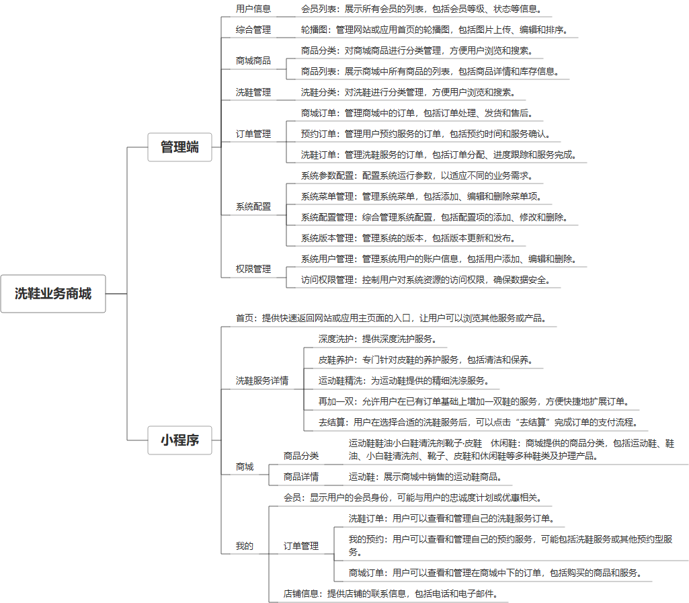

 

    
 

公司拥有上百套具有自主知识产权的软件系统，详情请查看码云首页或公司官网

 
<h1>洗鞋小程序</h1>

<a href="https://www.haishi.net.cn/">公司官网</a> ｜ <a href="https://www.haishi.net.cn/">在线体验</a>

 

## 系统介绍

为洗鞋店提供在线下单平台，包含小程序和管理端，支持预约订单、商城订单、商铺客服等功能。
为洗鞋店提供在线下单平台，包含小程序和管理端，支持预约订单、商城订单、商铺客服等功能。
本项目名称为洗鞋业务商城小程序系统，是一个基于小程序的在线洗鞋服务平台。该系统提供在线下单、订单管理、商品管理、用户信息管理、系统配置等功能，方便用户在线下单洗鞋服务，商家管理洗鞋业务，管理员进行系统维护。
本项目主要包含一个小程序端和一个后台管理系统。
- 小程序端：用户使用，主要功能包括首页浏览、商城购物、洗鞋下单、订单查看等。
- 后台管理系统：管理员使用，主要功能包括轮播图管理、商品分类管理、商品列表管理、洗鞋分类管理、商城订单管理、预约订单管理、洗鞋订单管理、系统参数配置、系统菜单管理、系统配置管理、系统用户管理、访问权限管理等。
                

## 系统功能介绍

### 系统包含终端说明

管理端（WEB）、用户端（微信小程序）

| 序号 | 模块 | 模块说明 |
| --- | --- | --- |
| 1 | FWY-SHOP-XX-SERVER | 服务端 |
| 2 | FWY-SHOP-XX-MP | 小程序 |

### 系统功能结构

### 系统功能说明

主要功能：
- 用户下单：用户可以通过小程序在线下单洗鞋服务，选择不同的洗鞋类型和服务。
- 订单管理：用户和管理员可以对订单进行管理，包括查看订单状态、修改订单信息、取消订单等。
- 商品管理：管理员可以对商城中的商品进行管理，包括添加商品、修改商品信息、删除商品等。
- 洗鞋分类管理：管理员可以对洗鞋的分类进行管理，方便用户选择不同的洗鞋服务。
- 系统管理：管理员可以对系统进行配置和管理，包括系统参数配置、用户管理、权限管理等。

## 系统主要界面

## 系统技术说明

### 代码模块说明

| 序号 | 目录 | 目录说明 |
| --- | --- | --- |
| 1 | FWY-SHOP-XX-SERVER/route | -- |
| 2 | FWY-SHOP-XX-SERVER/config | -- |
| 3 | FWY-SHOP-XX-SERVER/runtime | -- |
| 4 | FWY-SHOP-XX-SERVER/thinkphp | -- |
| 5 | FWY-SHOP-XX-SERVER/public | -- |
| 6 | FWY-SHOP-XX-SERVER/application | -- |
| 7 | FWY-SHOP-XX-SERVER/vendor | -- |

### 系统技术选型

#### 开发语言/框架

PHP
前端框架：VUE2

#### 服务中间件

Apache

#### 数据库

MySQL（5.7+）

#### 其他说明

无

## 系统演示/商用

请扫码添加客服微信获取演示地址和系统详细资料。

如果您想基于洗鞋小程序进行商业化交付或定制开发服务，我们提供有偿的技术服务支持，合作模式不限，欢迎沟通！

公司官网地址： <a href="https://www.haishi.net.cn/">https://www.haishi.net.cn</a>

联系客服获取专业回答。

## 使用须知

1、 本项目商用必须获得版权所有者的授权。

2、 未经允许本项目代码不允许二次出售。

